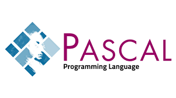

<h1 align="center" style="color:blue">Learning Pascal</h1>

<p align="center">


## Apa itu Pascal?

Pascal adalah bahasa pemrograman yang pertama kali di buat oleh Profesor Niklaus Wirth, seorang anggota International Federation of Information Processing (IFIP) pada tahun 1971. Dengan mengambil nama dari matematikawan Prancis, Blaise Pascal, yang pertama kali menciptakan mesin penghitung, Profesor Niklaus Wirth membuat bahasa Pascal ini sebagai alat bantu untuk mengajarkan konsep pemrograman komputer kepada mahasiswanya. Selain itu, Profesor Niklaus Wirth membuat Pascal juga untuk melengkapi kekurangan-kekurangan bahasa pemrograman yang ada pada saat itu.

Kelebihan dari bahasa pemrograman Pascal adalah:

- Tipe Data Standar, tipe-tipe data standar yang telah tersedia pada kebanyakan bahasa pemrograman. Pascal memiliki tipe data standar: boolean, integer, real, char, string,
- User defined Data Types, programmer dapat membuat tipe data lain yang diturunkan dari tipe data standar.
- Strongly-typed, programmer harus menentukan tipe data dari suatu variabel, dan variabel tersebut tidak dapat dipergunakan untuk menyimpan tipe data selain dari format yang ditentukan.
- Terstruktur, memiliki sintaks yang memungkinkan penulisan program dipecah menjadi fungsi-fungsi kecil (procedure dan function) yang dapat dipergunakan berulang-ulang.
- Sederhana dan Ekspresif, memiliki struktur yang sederhana dan sangat mendekati bahasa manusia (bahasa Inggris) sehingga mudah dipelajari dan dipahami.

Bahasa PASCAL juga merupakan bahasa yang digunakan sebagai standar bahasa pemrograman bagi tim nasional Olimpiade Komputer Indonesia (TOKI). Selain itu, Bahasa PASCAL sudah tidak digunakan lagi dalam IOI (International Olympiad in Informatics) sejak tahun 2019 mengingat hanya ada 1 peserta yang menggunakan bahasa ini dan hasil dari voting GA meeting pada tahun sebelumnya.

Contoh program Hello World menggunakan bahasa pascal adalah sebagai berikut:

```pascal
Program HelloWorld;
begin
   writeln('Hello world');
end
```

<hr>

## Download dan Instalasi Pascal

Untuk mengunduh dan menginstal bahasa pascal, sesuaikan dengan sistem operasi yang digunakan dan silahkan klik link berikut:

### [![Install with Windows][windows-img]][windows-guide] [Install with Windows][windows-guide]

### [![Install with Linux][linux-img]][linux-guide] [Install with Linux][linux-guide]

<hr>

## Materi dan Pembahasan

<hr>

## Kumpulan Source Code dan EBook

<!-- Image -->

[windows-img]: https://img.icons8.com/color/24/000000/windows-10.png
[linux-img]: https://img.icons8.com/color/24/000000/linux--v1.png

<!-- Internal Link -->

[windows-guide]: ./install_windows/install_pascal_windows.md
[linux-guide]: ./install_linux/install_pascal_linux.md
