## Instalasi Pascal di Linux

Kita akan menggunakan Free Pascal sebagai compiler untuk menjalankan program Pascal. Untuk tahapan instalasi, silakan mengikuti instruksi yang disediakan pada link berikut:

1. Langkah pertama yang harus dilakukan untuk menyiapkan laptop/komputer kita agar siap dalam melakukan pemrograman Free Pascal adalah melakukan download file instalasi pada halaman resmi di link dibawah ini:

   > https://www.freepascal.org/download.html

2. Pada halaman tersebut silahkan pilih versi sistem operasi yang anda gunakan. Misalnya kita menggunakan linux maka klik pada Linux.

   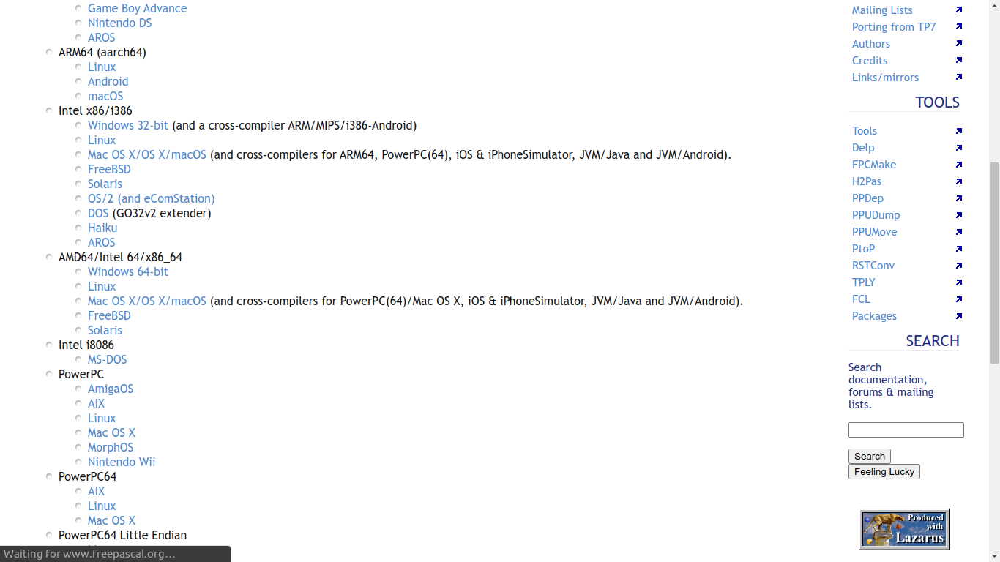

3. Kemudian pilih server untuk download. Misalkan kita pilih SourceForge.

   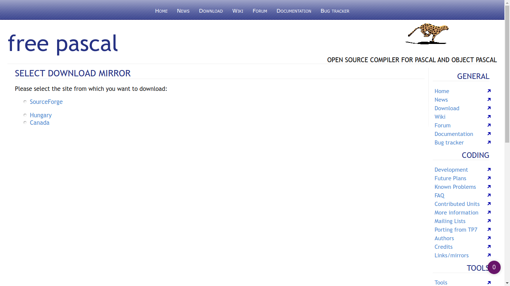

4. Halaman akan dialihkan ke halaman SourceForge untuk memilih versi release.
   Pilih fpc-3.2.0-x86_64-linux.tar.gz

  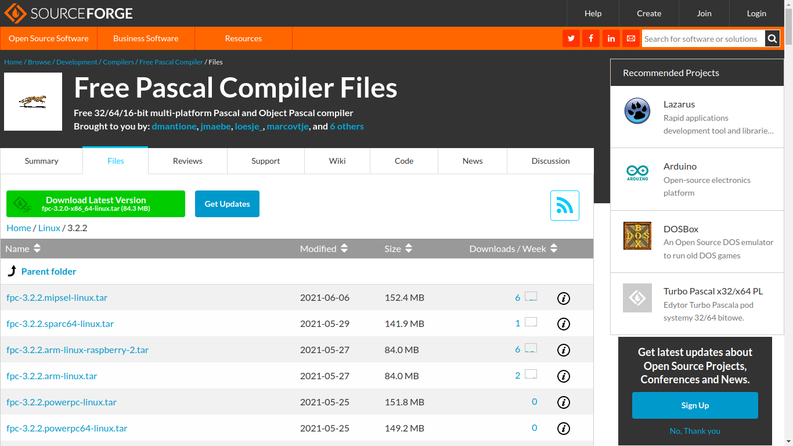
5. Kemudian tunggu proses download selesai.
   
   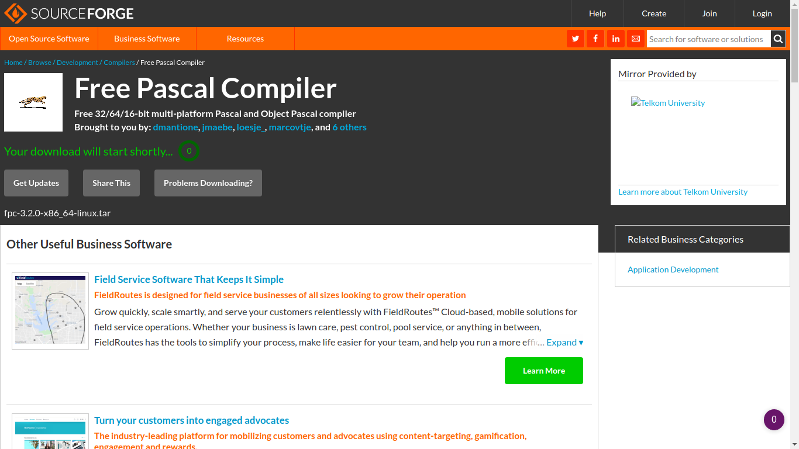
6. Kemudian ekstrak file yang sudah didownload.
   
   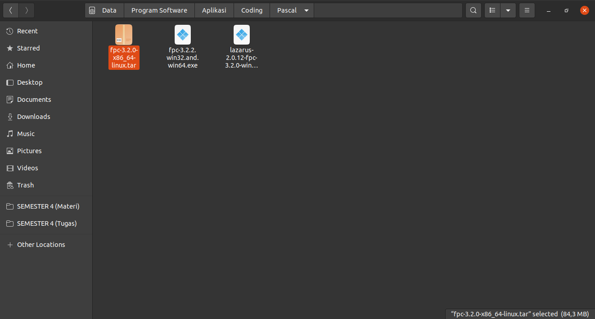
7. Kemudian buka folder hasil ekstrak dan buka terminal di folder tersebut.
    
    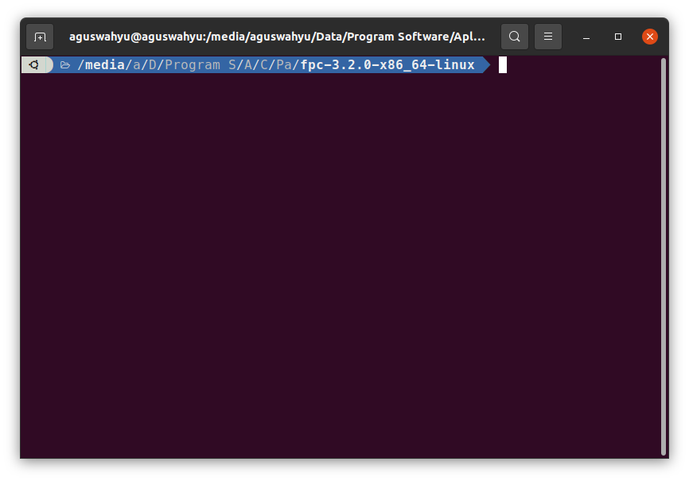
8. Kemudian ketikkan `sudo su` dan masukkan password untuk masuk ke mode super user.
    
    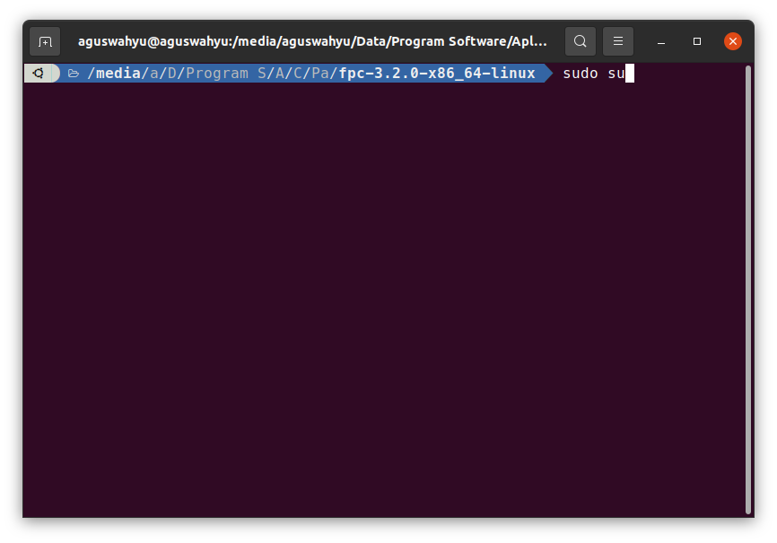
9. Kemudian ketikkan `./install.sh` untuk menjalanakan instalasi.
    
    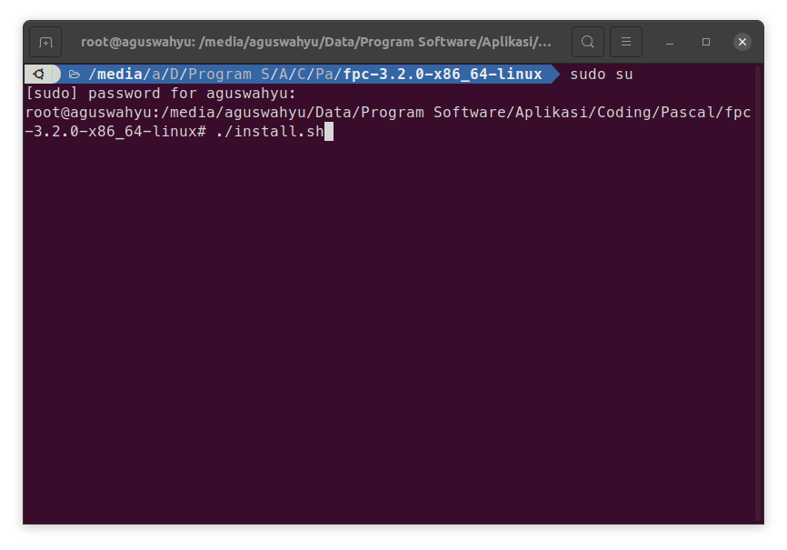
10. Kemudian ketik `/usr` 
    
    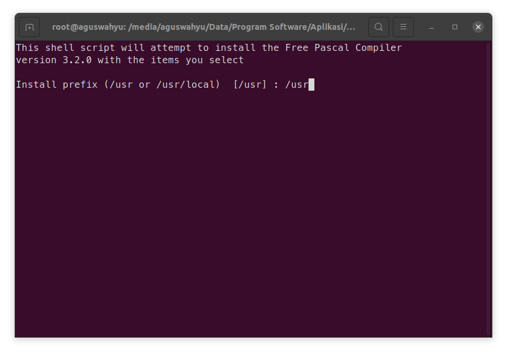
11. Tunggu proses instalasi selesai.
    
    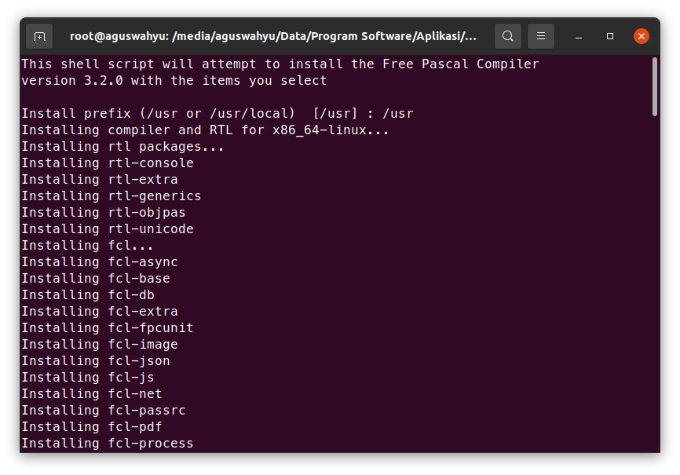
12. Kemudian ketikkan `y` untuk pertanyaan (Y/n) dan ketikkan `/usr/doc` ketika memilih tempat demos.
    
    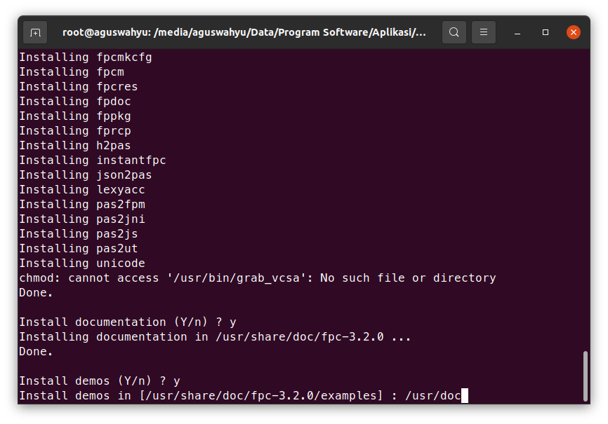
13. Proses instalasi sudah selesai, ketikkan `exit` pada terminal untuk keluar dari mode super user.
    
    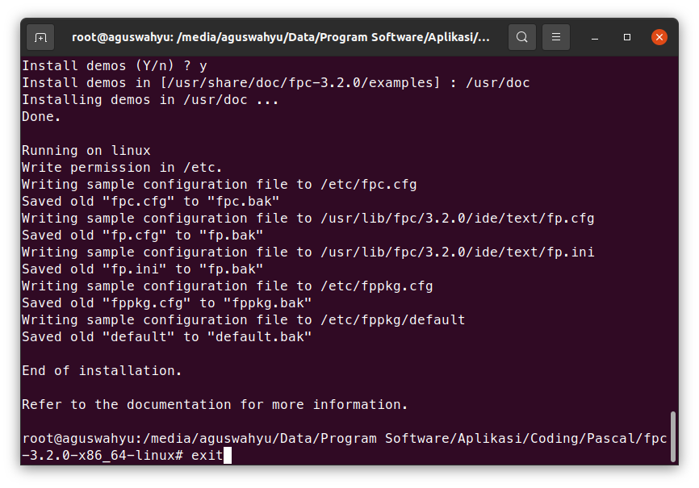
14. Untuk memastikan free pascal sudah terinstall, silakan buka terminal dan ketikkan `fpc -i` dan akan muncul seperti dibawah ini.
    
    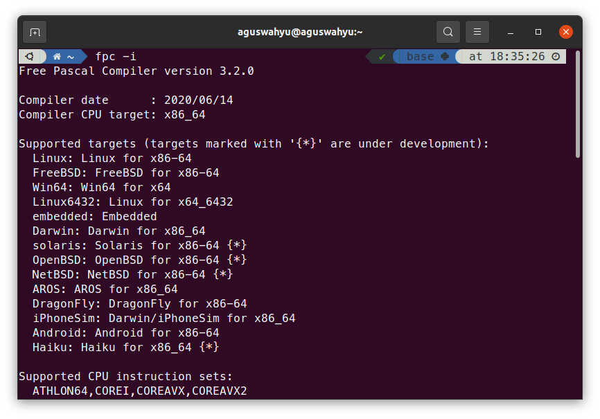
15. Jika sudah terinstall, maka kita bisa menjalankan program Pascal dengan mengetikkan `fp` pada terminal.
    
    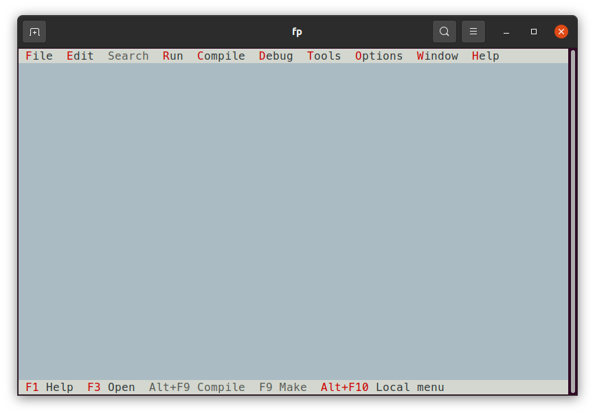

16.  Selamat, free pascal sudah terinstall di laptopmu :)
