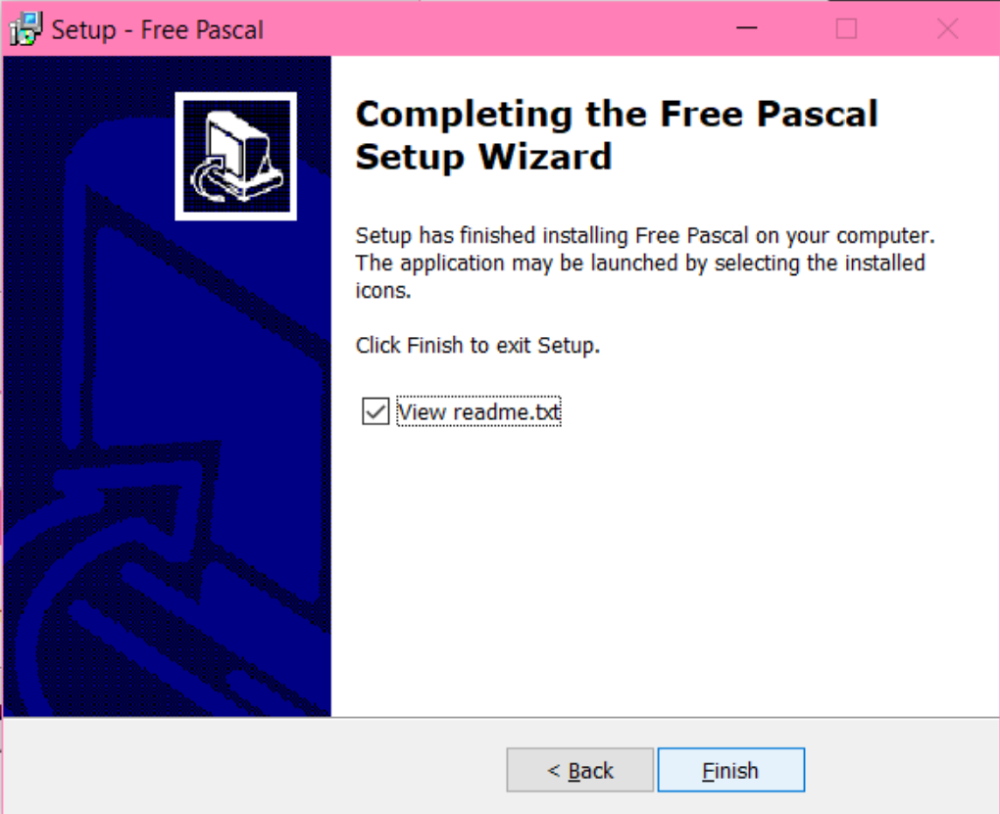
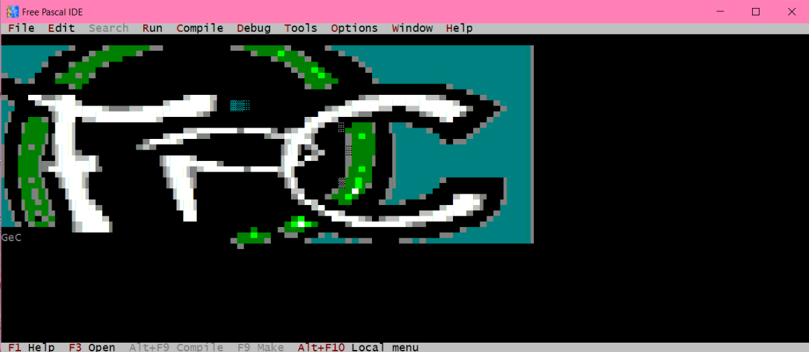

## Instalasi Pascal di Windows

Kita akan menggunakan Free Pascal sebagai compiler untuk menjalankan program Pascal. Untuk tahapan instalasi, silakan mengikuti instruksi yang disediakan pada link berikut:

1. Langkah pertama yang harus dilakukan untuk menyiapkan laptop/komputer kita agar siap dalam melakukan pemrograman Free Pascal adalah melakukan download file instalasi pada halaman resmi di link dibawah ini:

   > https://www.freepascal.org/download.html

2. Pada halaman tersebut silahkan pilih versi sistem operasi yang anda gunakan. Misalnya kita menggunakan Windows maka klik pada Windows 64-bit.

   

3. Kemudian pilih server untuk download. Misalkan kita pilih SourceForge.

   

4. Halaman akan dialihkan ke halaman SourceForge untuk memilih versi release.
   Pilih fpc-3.2.2.i386-win32.exe

   

5. Kemudian tunggu proses download selesai.

   

6. Jalankan file instalasi.Klik next.

   

7. Tentukan lokasi file instalasi. (bisa diketikkan atau browse untuk memilih lokasi).

   

8. Pilih tipe instalasi, misalkan full installation, dan klik next.

   

9. Pilih lokasi shortcut akan diletakkan. Jika ingin mengubah, klik browse dan pilih lokasi. Jika tidak ingin mengubah langsung klik next.

   

10. Pilih ekstensi file yang akan diasosiasikan dengan software free Pascal.

    

11. Kemudian lihat ringkasan instalasi, pastikan sudah benar sebelum proses instalasi dilanjutkan.

    

12. Jika sudah benar, klik install dan tunggu proses selesai.

    

13. Klik next.

    

14. Klik next.

    

15. Pergi ke desktop dan pastikan sudah ada shortcut Free Pascal IDE.

    

16. Untuk membuka Free Pascal, klik 2x pada icon. Dan akan muncul tampilan.

  
  
17. Selamat, free pascal sudah terinstall di laptopmu :)
