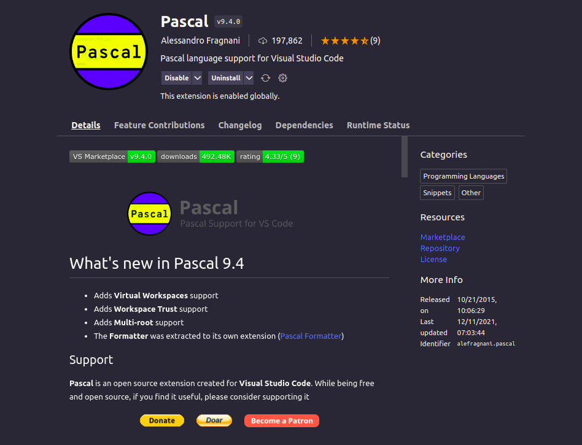
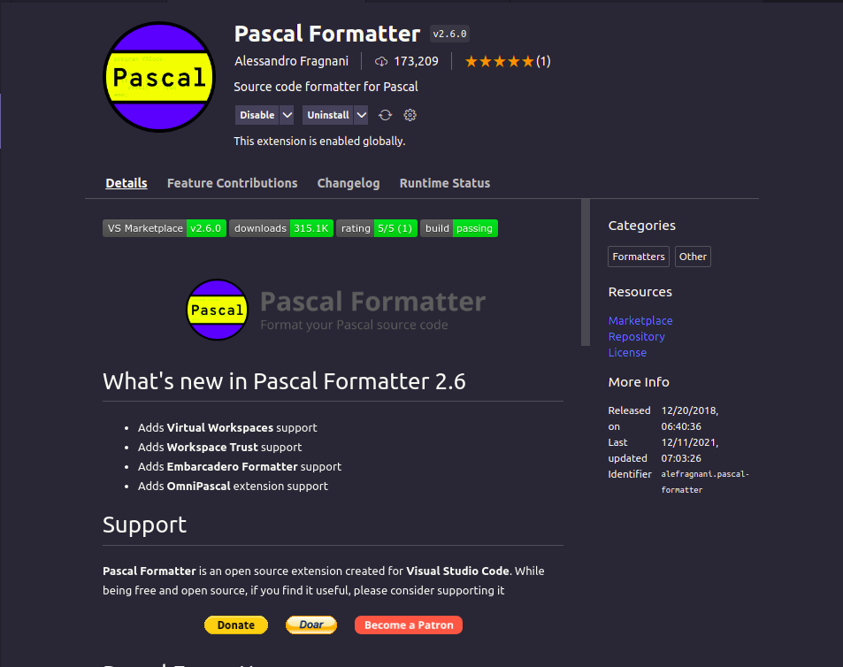
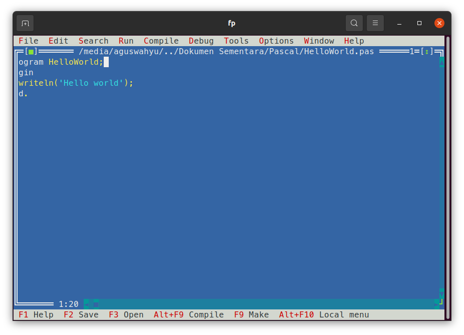
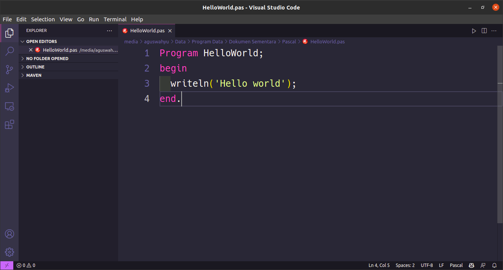

## Pascal di Visual Studio Code
![vscode-img]

[Halaman Awal]

Ekstensi Pascal menambahkan dukungan untuk bahasa Pascal dan IDEnya seperti Delphi dan FreePascal.

Untuk menggunakan Pascal di VS Code maka anda harus menambahkan ekstensi Pascal yaitu : 

> Name: Pascal  
Id: alefragnani.pascal 
Description: Pascal language support for Visual Studio Code 
Version: 9.4.0 
Publisher: Alessandro Fragnani 
VS Marketplace Link: https://marketplace.visualstudio.com/items?itemName=alefragnani.pascal 

>Name: Pascal Formatter 
Id: alefragnani.pascal-formatter 
Description: Source code formatter for Pascal 
Version: 2.6.0 
Publisher: Alessandro Fragnani 
VS Marketplace Link: https://marketplace.visualstudio.com/items?itemName=alefragnani.pascal-formatter

Tampilan Pascal: 
* Tampilan Free Pascal IDE:

* Tampilan Visual Studio Code Editor dengan ekstensi Pascal:

[Halaman Awal]:./README.MD
[vscode-img]: https://img.icons8.com/color/50/000000/visual-studio--v1.png